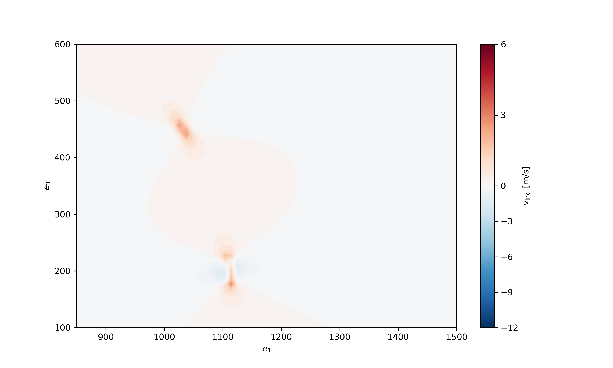

# AWEWA
### Airborne Wind Energy Wake Analysis

## Summary

This pipeline lets you **cross-check** your results from [awebox](https://github.com/awebox/awebox) using the open-source mid-fidelity aerodynamic solver [DUST](https://www.dust.polimi.it/).  
You first optimize your trajectory in *awebox*, and this code then helps you translate your trajectory, orientation, and related data into DUST input files.  
The results from DUST can be visualized with tools such as [ParaView](https://www.paraview.org/download/), or directly with this code to produce visualizations like the heatmap shown below:




## Installing DUST

[DUST](https://www.dust.polimi.it/) is an open-source mid-fidelity aerodynamic solver that was co-developed by **A³ by Airbus** and the Department of Aerospace Science and Technology at Politecnico di Milano.  

There will soon be (or already is) a commercial version of DUST, but there is also an open-source version available.  

Here is my personal guide on how to download DUST, including some of the errors I ran into and how to avoid/fix them:

1. Go to the [official DUST GitHub repository](https://public.gitlab.polimi.it/DAER/dust).
2. Scroll down and click on *installation guidelines*.
3. You will now automatically be on the *master* branch, but to ensure that you are installing the latest version of DUST, switch to the *develop* branch.
4. Choose your operating system and follow the steps (for me, it was Apple Silicon).
5. In my case (Apple Silicon), I ran into the following problems:
   - Several typos in the commands, for example, a double `install` in the first line.  
   - If you use Anaconda, make sure to **deactivate it** before running the commands in the terminal. There seems to be a conflict between Anaconda and CMake.  
   - If the line  
     ```
     brew install cmake lapack blas openblas cgns hdf5 llvm
     ```  
     gives you an error, try removing `blas`. It seems to already be included in `openblas`.
6. Once DUST is installed, I recommend going through the examples by following the *dust quick start* document. Both of these should already be downloaded when you follow the instructions from the [official DUST GitHub repository](https://public.gitlab.polimi.it/DAER/dust).
7. If you run into problems while using DUST, there is a [forum](https://public.gitlab.polimi.it/DAER/dust/-/issues) where you can ask questions or check if someone else has already solved your problem.

---

## Visualisations in ParaView

To visualize the wake, I used [ParaView](https://www.paraview.org/download/). The installation process is very straightforward, and I didn’t run into any issues.  

The DUST examples, as well as the pipeline, will output a folder of `.vtu` files. These contain wake visualizations and can be opened in ParaView.  

- If you open the **entire folder**, you’ll see an animation of how the wake builds up for each time step of your simulation.  
- If you want to examine the wake at a **specific timestep**, open that file directly.

## Using the pipeline

There are two Jupyter Notebooks demonstrating example uses of the pipeline — one for a dual-kite trajectory and another for a single-kite case. The notebooks are structured similarly to this section, making it easy to follow along. Once you have installed DUST and ParaView and cloned this repository, you can proceed with the steps below.

### Creating the elliptic wing

The provided code assumes an **elliptic wing**. If this assumption does not apply to your case, you will need to create a custom input file for the structure, as described in the DUST user manual.  

If you are working with an elliptic wing (or can reasonably make that assumption), you can use the function `create_elliptic_wing`.  

- **folder_path**: the directory where the DUST input file containing the wing geometry will be created. All other DUST input files will also be stored here. It is recommended to create a dedicated folder for these files to keep them organized.  
- **span** and **aspect ratio**: define the span and aspect ratio of the wing (in meters).  
- **n_spa_elements**: the number of elements in the spanwise direction that connect sections of different chord lengths. This controls how smooth the elliptic wing appears.  
- **n_span_subdivisions**: the number of subelements each spanwise element is divided into. Both parameters strongly impact simulation runtime, so start with small values. Examples are provided in this repository and in the [official DUST GitHub repository](https://public.gitlab.polimi.it/DAER/dust).  
- **airfoil_profile**: specify the airfoil profile (must be a four-digit NACA profile, e.g., `NACA0012`). A useful resource is [airfoiltools](http://airfoiltools.com/search/index?m%5Bgrp%5D=naca4d&m%5Bsort%5D=1), which also provides 2D polars.  
- **end_chord**: since the wing is discretized, the chord at the tip cannot be exactly zero. This parameter sets the chord length (in meters) of the final section. Choose smaller values for finer discretization and larger values for coarser discretization.  
- **ll_or_vl**: determines which modeling technique is applied. Use `ll` for a lifting-line model or `vl` for a vortex-lattice model. If you choose the vortex-lattice method, also set **n_chord_elements**, which strongly affects runtime. For lifting-line models, this parameter is ignored.  
- **airfoil_table**: when using the lifting-line method, link an airfoil table by setting this parameter to the path of the corresponding file. The table must be in **c.81 format** and contains lift and drag coefficients for varying angles of attack and Mach numbers. This allows the lifting-line method to account for viscous drag. Since c.81 files are uncommon, you can generate them with XFOIL, but for convenience, the NACA0012 profile and its table are already included in this repository.  


