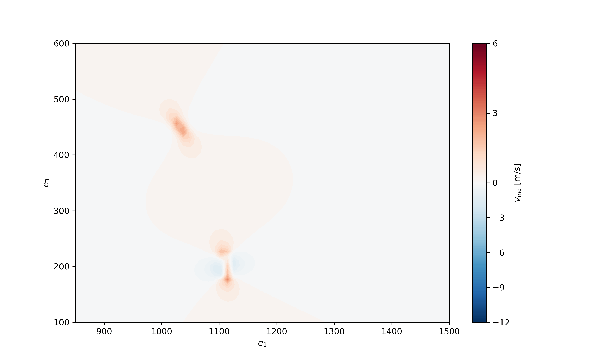
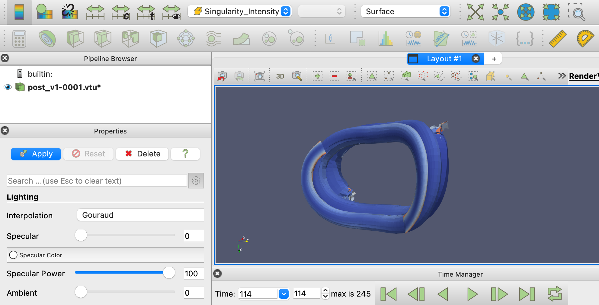
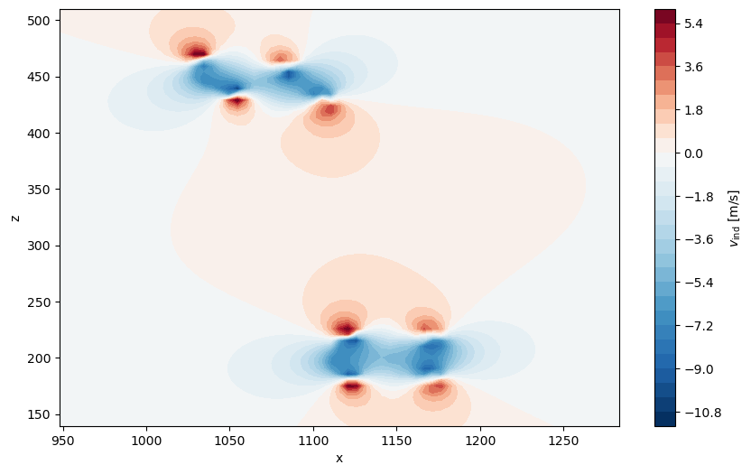
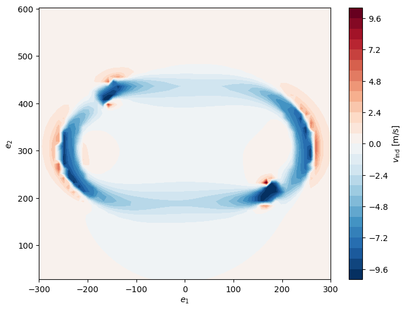

# AWEWA
### Airborne Wind Energy Wake Analysis

## Summary

This pipeline lets you **cross-check** your results from [awebox](https://github.com/awebox/awebox) using the open-source mid-fidelity aerodynamic solver [DUST](https://www.dust.polimi.it/).  
You first optimize your trajectory in *awebox*, and this code then helps you translate your trajectory, orientation, and related data into DUST input files.  
The results from DUST can be visualized with tools such as [ParaView](https://www.paraview.org/download/), or directly with this code to produce visualizations like the heatmap shown below:




---
## Installing DUST

[DUST](https://www.dust.polimi.it/) is an open-source mid-fidelity aerodynamic solver that was co-developed by **A³ by Airbus** and the Department of Aerospace Science and Technology at Politecnico di Milano.  

There will soon be (or already is) a commercial version of DUST, but there is also an open-source version available.  

Here is my personal guide on how to download DUST, including some of the errors I ran into and how to avoid/fix them:

1. Go to the [official DUST GitHub repository](https://public.gitlab.polimi.it/DAER/dust).
2. Scroll down and click on *installation guidelines*.
3. You will now automatically be on the *master* branch, but to ensure that you are installing the latest version of DUST, switch to the *develop* branch.
4. Choose your operating system and follow the steps (for me, it was Apple Silicon).
5. In my case (Apple Silicon), I ran into the following problems:
   - Several typos in the commands, for example, a double `install` in the first line.  
   - If you use Anaconda, make sure to **deactivate it** before running the commands in the terminal. There seems to be a conflict between Anaconda and CMake.  
   - If the line  
     ```
     brew install cmake lapack blas openblas cgns hdf5 llvm
     ```  
     gives you an error, try removing `blas`. It seems to already be included in `openblas`.
6. Once DUST is installed, I recommend going through the examples by following the *dust quick start* document. Both of these should already be downloaded when you follow the instructions from the [official DUST GitHub repository](https://public.gitlab.polimi.it/DAER/dust).
7. If you run into problems while using DUST, there is a [forum](https://public.gitlab.polimi.it/DAER/dust/-/issues) where you can ask questions or check if someone else has already solved your problem.

---

## Visualisations in ParaView

To visualize the wake, I used [ParaView](https://www.paraview.org/download/). The installation process is very straightforward, and I didn’t run into any issues.  

The DUST examples, as well as the pipeline, will output a folder of `.vtu` files. These contain wake visualizations and can be opened in ParaView.  

- If you open the **entire folder**, you’ll see an animation of how the wake builds up for each time step of your simulation.  
- If you want to examine the wake at a **specific timestep**, open that file directly.

---

## Using the pipeline

There are two Jupyter Notebooks demonstrating example uses of the pipeline — one for a dual-kite trajectory and another for a single-kite case. The notebooks are structured similarly to this section, making it easy to follow along. Once you have installed DUST and ParaView and cloned this repository, you can proceed with the steps below.

### Creating the elliptic wing

First, note that the provided code is based on the assumption of an elliptic wing. If this assumption does not apply to your case, you will need to create a custom input file for the structure, as described in the DUST user manual.  

However, if you are working with an elliptic wing, or can reasonably make that assumption, you can simply use the function `create_elliptic_wing`.  

The first argument of the function is `folder_path`, which specifies the directory where the DUST input file containing the wing geometry will be created. All other DUST input files will also be stored in this directory. I recommend creating a dedicated folder for these files to keep them organized for this and the following functions.  

The next two arguments define the span and aspect ratio of the wing (in meters). After that, you provide `n_spa_elements` and `n_span_subdivisions`. The former sets the number of elements in the spanwise direction that connect sections of different chord lengths, essentially controlling how smooth the elliptic wing appears. The latter specifies into how many subelements each of these spanwise elements is divided into.  
Both parameters have a significant impact on the runtime of your simulation, so I suggest starting with small values. For guidance, you can refer to the examples in this repository or the official DUST GitHub repository.  

The parameter `airfoil_profile` specifies the airfoil profile to be used. It must be one of the four-digit NACA profiles, such as `NACA0012`. A useful resource for selecting a profile is the website [airfoiltools](http://airfoiltools.com/search/index?m%5Bgrp%5D=naca4d&m%5Bsort%5D=1), which also provides 2D polars.  

Since we are not working with a perfectly elliptic wing but rather a discretized version, the chord length at the wing tip cannot be exactly zero. With the parameter `end_chord`, you can define the chord length (in meters) of the final section. I recommend choosing this value based on the level of discretization: for finer discretization, select a smaller value; for coarser discretization, a larger one.  

The parameter `ll_or_vl` determines which modeling technique is applied. Use `ll` for a lifting-line model or `vl` for a vortex-lattice model. If you choose the vortex-lattice approach, you also need to set the parameter `n_chord_elements`. Since this parameter strongly affects the runtime of the simulation, I suggest starting with a small value. For lifting-line models, this parameter is ignored.  

When using the lifting-line method, you must additionally link an airfoil table by setting the parameter `airfoil_table` to the path of the corresponding file. This table must be in the c.81 format and contains lift and drag coefficients of the chosen airfoil profile for varying angles of attack and Mach numbers. The table enables the lifting-line method to account for viscous drag in the simulation. Unfortunately, c.81 is a relatively uncommon format and cannot be directly downloaded for arbitrary airfoil profiles. It can be generated with XFOIL, although this requires installing additional software. For convenience, I recommend using the NACA0012 profile, for which the required table is already provided in this repository, whenever it is important to include viscous drag and the properties of the wing are not too different from the NACA0012.

### Creating the simulation input files

The next step is to call the function `create_dust_files`. This function generates the required `.dat` files for trajectory and angles while also creating or updating the DUST input files to ensure consistency with the awebox trajectory.  

The first parameter, `n_rot`, defines the number of rotations to be simulated. For a dual-kite setup, this corresponds to the number of half-rotations per kite, while for a single-kite setup, it refers to the number of full rotations.  

The parameter `res` controls the resolution of the data. A value of 1 includes every data point, a value of 2 uses every second point, and so on. Reducing the resolution can significantly speed up simulations, which is especially useful for long trajectories.  

The parameter `file_path_awebox` specifies the location of the CSV file containing your awebox results, while `folder_path` sets the directory where the generated `.dat` files and DUST input files will be stored. To stay organized, it is best to create a dedicated folder for this purpose.  

With `single_or_dual`, you can choose between a single-wing or dual-wing configuration. The option `particles_or_panels` determines how the wake is modeled: with particles or with panels. Selecting particles automatically applies DUST’s Fast Multipole Method (FMM), which can accelerate the simulation but may occasionally lead to unexpected errors.  

Another important parameter is the boolean `apply_pitch_correction`. When set to `True`, it ensures that the wing modelled in awebox and the one modelled in DUST generate the same lift throughout the trajectory by adjusting the pitch angle. In this case, three aerodynamic parameters must also be provided: `CL0`, the lift coefficient at zero angle of attack, as well as `alpha_max` and `alpha_min`, which define the maximum and minimum angles of attack in degrees, typically also taken from the 3D lift curve. 

Lastly, set the parameter `dof` to either 3 or 6, depending on whether your Awebox simulations were run with 3 or 6 degrees of freedom. This parameter is important because Awebox uses different conventions for the wing orientation depending on the number of degrees of freedom. **In some cases, the orientation might still change unexpectedly—I haven’t determined the exact reason—but if your trajectory looks incorrect, I recommend adjusting this parameter first to check whether the orientation convention differs from what you expected.**

Once the input files are prepared, the simulation can be launched by calling the function `run_full_simulation` and pointing it to the folder where your DUST files were created. The solver will then begin, and you can monitor the time required for each simulation step. As the wake becomes more complex, later steps generally take longer to compute.  

After completion, two new folders will appear alongside your DUST files: `Output` and `Postprocessing`. The results of interest are stored in the `Postprocessing` folder. By default, the function `create_dust_files` generates post-processing outputs such as wake visualizations and wing load data. The loads over time are saved in `.dat` files, while the wake visualization produces a set of `.vtu` files, which can be opened in ParaView as described earlier. Additional post-processing options will be explained in the following section.



### Additional Postprocessing

#### Velocity in front of kite

When investigating the induced velocity of the wake, it would be ideal to know the velocity at the position of the kite itself. However, due to singularities on the wing, this is not possible. Instead, the velocity can be evaluated at points in front of the kite. The function `velocity_in_front_of_kite` provides this functionality. You can specify a distance (in meters), and for each timestep the function determines a point located that distance in front of the kite, along the direction in which the kite is oriented at that timestep. Then, if you are interested in the induced velocity, you can subtract the freestream velocity.  


#### Heatmap in xz plane

If you want to visualize the induced velocity in a certain plane, you can use DUST flowfield analysis in the postprocessing step. The function `create_or_change_flow_field_analysis` creates the respective postprocessing input file that you need for that.  

The first parameter, `folder_path`, specifies the path to the folder where you stored your DUST files. The parameter `start_res` defines the simulation step at which the flow field analysis begins, while `end_res` sets the step at which it ends. The simulation is very costly, so I would recommend not choosing a very wide span, or even just setting both parameters to the same step.  

The parameter `n_xyz` determines the number of points in the `x`, `y`, and `z` directions for the flow field analysis. It must be given in the format `(/1,1,1/)`. Similarly, the parameters `min_xyz` and `max_xyz` specify the minimum and maximum coordinates of the flow field analysis region, respectively, and must also follow the format `(/1,1,1/)`. Finally, the parameter `name` defines the name of the flow field analysis block.  

The function `calculate_flowfield_parameters_xz` can help you calculate the parameters that you need to evaluate the flowfield in the xy plane.  

The first parameter, `file_path_awebox`, specifies the location of the CSV file containing the output data from the awebox simulation. The parameter `timestep` defines the simulation step at which the flow field parameters should be evaluated. The parameter `res` must match the resolution that was used for the simulation. Same goes for the parameter `single_or_dual`. The parameter `y_position` sets the y-coordinate of the xz-plane in which the flow field parameters are to be evaluated; by default, this value is 0.  

The automatically suggested parameters may not always correspond exactly to the frame of interest. Depending on your trajectory, it can therefore be better to define your own parameters and pass them directly to the function `create_or_change_flow_field_analysis`.  

For instructions on how to process and interpret the data generated in this postprocessing step, please refer to the example notebooks.  



#### Heatmap in the plane of the kite(s)

If you want to visualize the induced velocity in the plane that is aligned with the kite’s motion, you can use the function `calculate_flowfield_parameters_kite_plane`. It provides the parameters required to perform a flow field analysis in the kite’s plane, similar to how `calculate_flowfield_parameters_xz` does for the xz-plane (see above for general information on flow field analysis setup).  

The parameter `frame_width` defines the size of the flow field analysis region around the kite(s). It determines how far the analysis extends in each direction from the kite’s current position and thus influences the size of the region for which the induced velocity will be evaluated.  

The function returns three results:  

- `min_xyz` and `max_xyz`, which specify the minimum and maximum coordinates of the flow field region in the format `(/x_min, y_min, z_min/)` and `(/x_max, y_max, z_max/)`, respectively, as described in the text above.  
- `v_normal`, a normalized vector that represents the elevation angle of the kite. This vector is required to determine the component of velocity or force that acts along the tether direction.  

Together, these parameters can then be used to generate the corresponding postprocessing input file via `create_or_change_flow_field_analysis`.  




